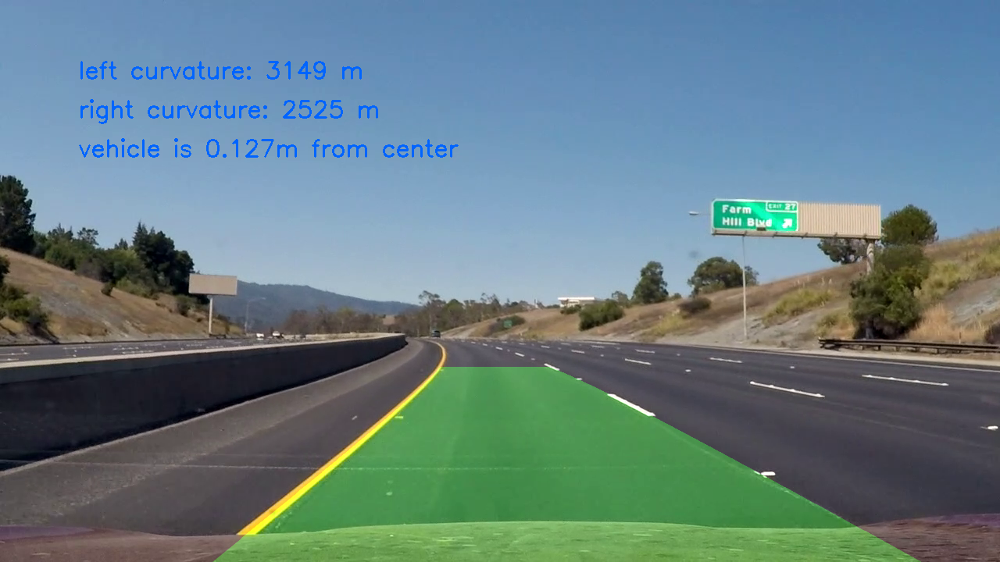

## Advanced Lane Finding

In this project, we create a pipeline to identify the lane boundaries in a video, 
the main function and code in detect.py

I saved examples of the output from each stage in the folder called `output_images`
There is also a video result

The Project
---

The steps of this project are the following:

* Compute the camera calibration matrix and distortion coefficients given a set of chessboard images.(done)
* Apply a distortion correction to raw images.(done)
* Use color transforms, gradients, etc., to create a thresholded binary image.

* Apply a perspective transform to rectify binary image ("birds-eye view").

* Detect lane pixels and fit to find the lane boundary. 

* Determine the curvature of the lane and vehicle position with respect to center. 
* Warp the detected lane boundaries back onto the original image.

* Output visual display of the lane boundaries and numerical estimation of lane curvature and vehicle position.

